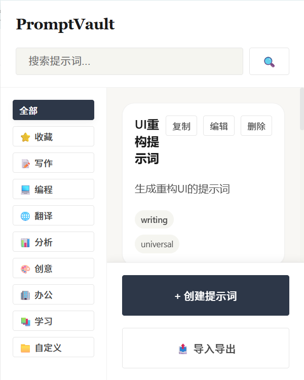
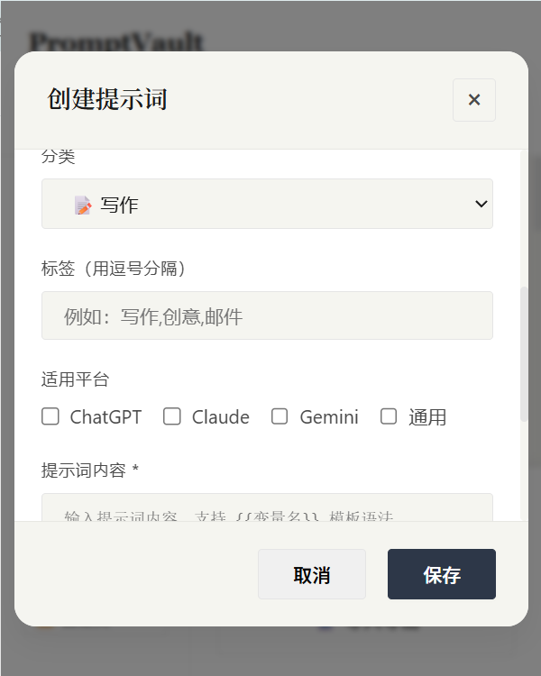
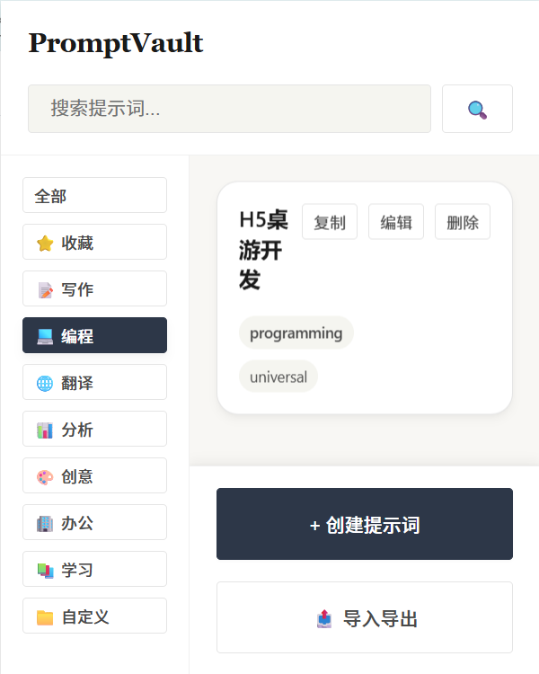
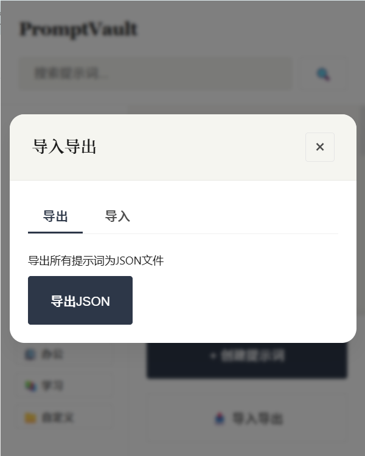
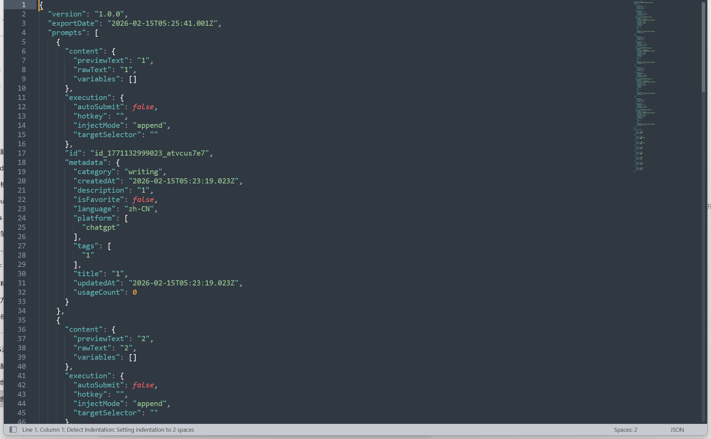
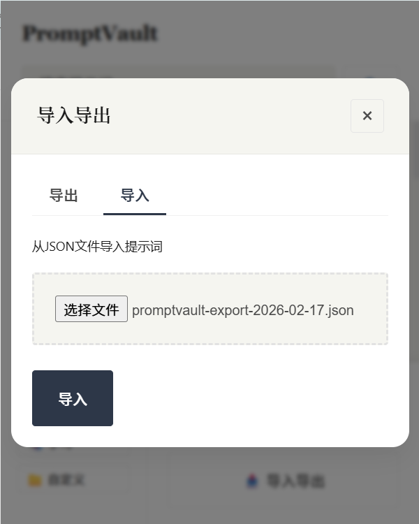
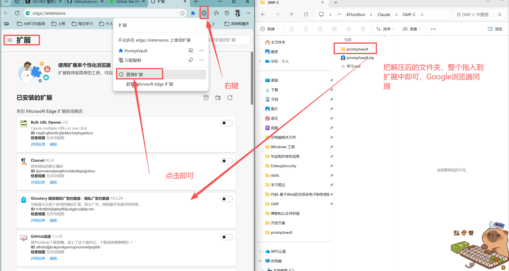
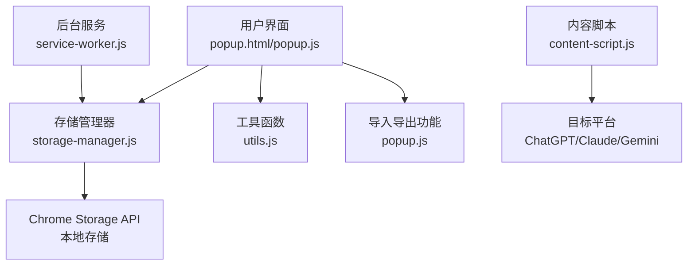

# PromptVault - 提示词管理器插件

一个功能强大的浏览器扩展，用于管理、分类和快速使用AI提示词。

## 项目概述

PromptVault 是一个基于 Chrome 扩展 Manifest V3 开发的提示词管理工具，帮助用户更高效地管理和使用AI提示词。

### 主要特性

- 📁 **分类管理**：支持提示词分类，便于组织和查找
- 🏷️ **标签系统**：为提示词添加标签，提供更灵活的分类方式
- ⭐ **收藏功能**：标记常用提示词，快速访问
- 📋 **一键复制**：点击即可复制提示词内容到剪贴板
- 💾 **本地存储**：使用 Chrome Storage API 安全存储
- 🌐 **多平台支持**：适配 ChatGPT、Claude、Gemini 等平台
- 📤 **导入导出**：支持提示词数据的导入导出，便于备份和分享
- 🔍 **搜索功能**：快速查找需要的提示词
- 🎨 **现代界面**：美观、直观的用户界面

## 版本历史

### v1.0.0 (2026-02-15)

- ✨ 初始版本发布
- 📁 实现提示词分类管理
- 🏷️ 添加标签系统
- ⭐ 实现收藏功能
- 📋 添加一键复制功能
- 💾 实现本地存储
- 🌐 支持多平台
- 📤 实现导入导出功能
- 🔍 添加搜索功能
- 🎨 设计现代界面

### v1.0.1 (2026-02-17)

- ✨ 重构UI界面
- 📁 增加插件图标

## 工具使用

### 主界面



### 创建提示词



### 左侧导行栏

点击就会在右侧显示对应分类的提示词



### 导入导出功能

导出功能，可以把在插件中保存的提示词进行导出，方便在切换电脑环境后，可以把保存的提示词进行导出使用





导入时选择导出的json文件即可



## 如何安装

找到浏览器的拓展部分，点击后进入拓展页面，把解压后的浏览器插件的整个文件夹，拖入到浏览器中，如果出现打开开发者模式，点击确定就行



## 技术架构

### 架构设计

PromptVault 采用模块化架构设计，遵循 Chrome 扩展的最佳实践：

1. **Popup 页面**：用户主要交互界面，显示提示词列表和管理功能
2. **Background Service Worker**：处理后台任务，如上下文菜单
3. **Content Scripts**：注入到目标页面，处理提示词注入
4. **Shared 模块**：共享工具函数和存储管理

### 数据流



## 目录结构

```
promptvault/
├── _locales/            # 本地化文件
│   ├── en/              # 英文本地化
│   └── zh_CN/            # 中文本地化
├── assets/              # 静态资源
│   └── icons/           # 图标文件
├── background/          # 后台服务
│   └── service-worker.js # 后台服务脚本
├── content/             # 内容脚本
│   └── content-script.js # 页面注入脚本
├── popup/               # 弹出窗口
│   ├── popup.html       # 弹出窗口HTML
│   ├── popup.css        # 弹出窗口样式
│   └── popup.js         # 弹出窗口逻辑
├── shared/              # 共享模块
│   ├── constants.js     # 常量定义
│   ├── storage-manager.js # 存储管理器
│   └── utils.js         # 工具函数
└── manifest.json        # 扩展配置文件
```

## 核心功能模块

### 1. 存储管理

**文件**：`shared/storage-manager.js`

- **功能**：管理提示词的CRUD操作，使用Chrome Storage API进行本地存储
- **主要方法**：
  - `init()`：初始化存储
  - `getAllPrompts()`：获取所有提示词
  - `createPrompt()`：创建新提示词
  - `updatePrompt()`：更新提示词
  - `deletePrompt()`：删除提示词
  - `exportPrompts()`：导出提示词
  - `importPrompts()`：导入提示词

### 2. 工具函数

**文件**：`shared/utils.js`

- **功能**：提供各种实用工具函数
- **主要方法**：
  - `parseTemplateVariables()`：解析模板变量
  - `renderTemplate()`：渲染模板
  - `formatDate()`：格式化日期
  - `detectPlatform()`：检测当前平台
  - `searchPrompts()`：搜索提示词
  - `sortPrompts()`：排序提示词
  - `downloadFile()`：下载文件
  - `showNotification()`：显示通知

### 3. 弹出窗口

**文件**：`popup/popup.js`

- **功能**：用户主要交互界面
- **主要功能**：
  - 提示词列表显示
  - 分类导航
  - 搜索功能
  - 提示词创建、编辑、删除
  - 导入导出功能
  - 提示词复制

### 4. 内容脚本

**文件**：`content/content-script.js`

- **功能**：注入到目标平台页面，处理提示词注入
- **支持平台**：
  - ChatGPT (`chat.openai.com`)
  - Claude (`claude.ai`)
  - Gemini (`gemini.google.com`)

### 5. 后台服务

**文件**：`background/service-worker.js`

- **功能**：处理后台任务，如上下文菜单
- **主要功能**：
  - 创建上下文菜单
  - 处理菜单点击事件

## 技术栈

### 前端技术

- **HTML5**：页面结构
- **CSS3**：样式设计
- **JavaScript (ES6+)**：核心逻辑
- **Chrome Extensions API**：扩展功能

### 存储

- **Chrome Storage API**：本地存储，持久化保存提示词数据

### 开发工具

- **Chrome浏览器**：扩展开发和测试
- **Visual Studio Code**：代码编辑

## 安装说明

### 从源码安装

1. 克隆或下载本项目到本地
2. 打开 Chrome 浏览器，访问 `chrome://extensions/
3. 开启 "开发者模式"
4. 点击 "加载已解压的扩展程序"
5. 选择项目根目录 `promptvault`
6. 扩展将被安装并显示在浏览器工具栏

## 使用指南

### 创建提示词

1. 点击浏览器工具栏中的 PromptVault 图标
2. 点击 "创建提示词" 按钮
3. 填写提示词标题、内容、分类等信息
4. 点击 "保存" 按钮

### 管理提示词

1. 在弹出窗口中浏览提示词列表
2. 使用左侧分类导航筛选提示词
3. 使用搜索框快速查找提示词
4. 点击提示词卡片上的按钮进行复制、编辑或删除操作

### 导入导出

1. 点击 "导入导出" 按钮
2. 在 "导出" 标签页点击 "导出JSON" 按钮下载提示词数据
3. 在 "导入" 标签页选择JSON文件，点击 "导入" 按钮导入提示词

### 使用提示词

1. 选择一个提示词
2. 点击 "复制" 按钮
3. 提示词内容将被复制到剪贴板
4. 在目标AI平台粘贴使用

## 配置选项

### 支持的平台

- **ChatGPT**：`chat.openai.com`
- **Claude**：`claude.ai`
- **Gemini**：`gemini.google.com`
- **通用**：适用于其他平台

### 默认分类

- 全部
- 收藏
- 写作
- 编程
- 翻译
- 分析
- 创意
- 办公
- 学习
- 自定义

## 开源协议

本项目采用 **[麻省理工学院许可](https://github.com/EdinLyle/promptvault/blob/main/LICENSE)** 开源。

## 贡献指南

我们欢迎社区贡献！如果您想为 PromptVault 做出贡献，请遵循以下步骤：

1. **Fork 仓库**：在 GitHub 上 fork 本项目
2. **创建分支**：为您的功能或修复创建新分支
3. **实现功能**：编写代码，确保遵循项目的代码风格
4. **测试**：确保您的更改不会破坏现有功能
5. **提交 PR**：创建 Pull Request，描述您的更改

### 代码风格

- 使用 2 个空格进行缩进
- 遵循 ES6+ 语法
- 使用语义化的变量和函数命名
- 添加适当的注释

## 问题反馈

如果您遇到任何问题或有功能建议，请在 GitHub 仓库中创建 Issue。

## Star History

[](https://www.star-history.com/#EdinLyle/promptvault&type=date&legend=top-left)

## 致谢

暂无

---

**享受管理提示词的乐趣！** 🎉
